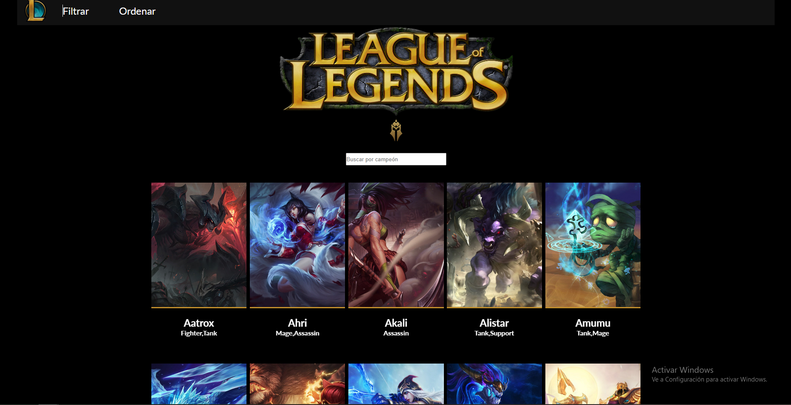
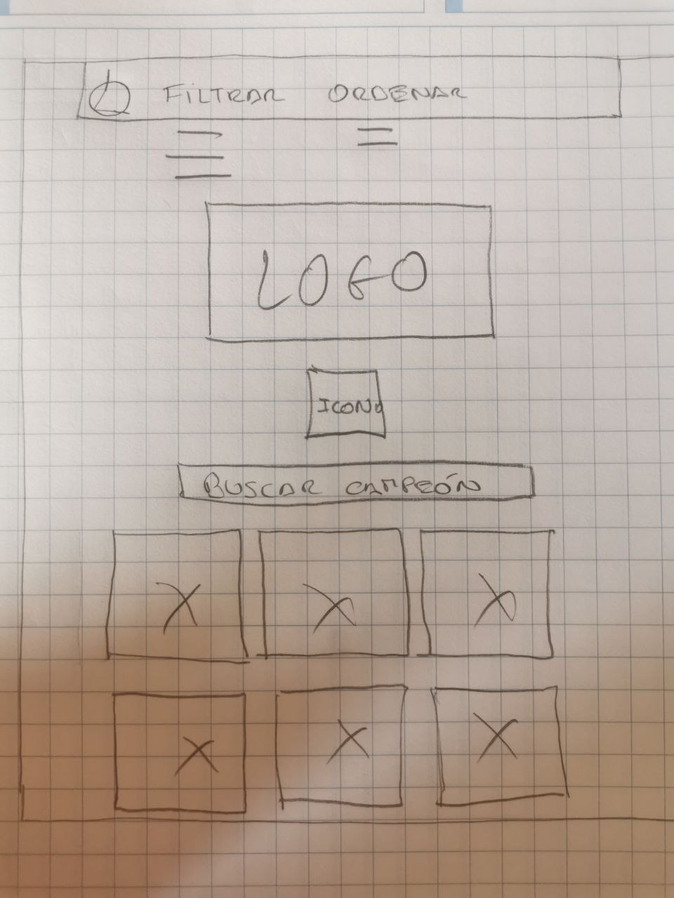

# INICIO DE PROYECTO #
- Elegir el proyecto: Legue of Legends

## imagen final del proyecto

![prototipo 1]

## ¿Quienes son los principales usuarios del producto? ##
- Mis principales usuarios son los jugadores de LOL

## ¿Cuales son los objetivos de estos usuarios en relación con tu producto? ##
- Su objetivo es poder ayudar con la informacion de los campeones para una mejor estrategia

## ¿como crees que el producto que estas creando está resolviendo sus problemas? ##
- Al poder crear estrategias nuevas en base a los datos

## Historias de Usuario

## - HU1:

* Yo como:Jugador de League of Legends
* Quiero: Poder tener acceso a información relevante de los champions
* Para: Crear equipos estrategicos y así ganar las partidas

- Criterios de aceptación:

* El jugador debe poder visualizar las cards con el título y el rol de cada
uno de los champions
* El jugador debe poder hacer click en cada card y obtener la información
relevante de cada champion

- Definición de terminado:

* Proyectar una página que se asemeje lo más posible al prototipo de af
* Consignar en la página las cards de todos los champions junto con la información establecida para la HU (tittle, tags, name, attack, defense, magic, difficulty)

## - HU2: filtrar la data

* Yo como: Jugador de League of Legends
* Quiero: Poder filtrar los champions de acuerdo a su rol o roles
* Para: Tener claridad sobre cuales champions pueden ser una buena alianza para ganar las partidas

- Criterios de aceptación:

* El jugador debe poder encontrar un filtro que le permita tener acceso puntual
al rol o los roles de los champions.
* El jugador debe poder seleccionar uno o varios roles para filtrar a los
champions

- Definición de terminado:

-Crear 6  buttoms que corresponderan a los 6 roles existentes de los
champions
-Lograr realizar el filtro un rol o de varios teniendo en cuenta que varios
champions cuentan con más de 1 solo rol

## - HU3:
Se debe permitir al usuario que pueda ordenar bien sea de mayor a menor o
visceversa el grado de attack o defense.

## - h4:
El usuario debe poder buscar a un campeon en especifico por medio de
una caja de busqueda

## Prototipo de proyecto
- Asi empezo mi prototipo

![prototipo 1]
